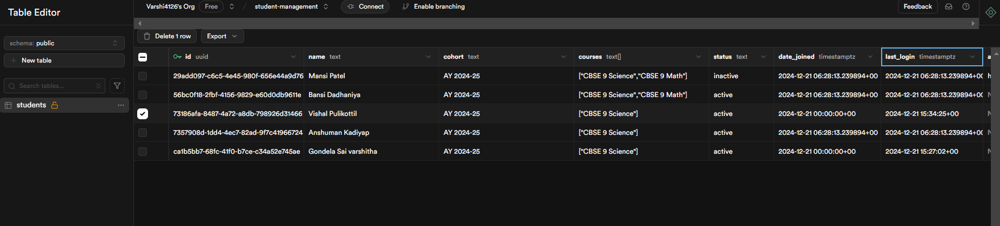

# Student Dashboard

A modern web application for managing student data, built with Next.js, React, TypeScript, and Supabase. This project serves as a recruitment demonstration showcasing full-stack development capabilities.

## 🚀 Live Demo

[View Live Demo](your-vercel-url-here)

## ✨ Features

- **Student Management**
  - Add new students with detailed information
  - View student profiles and enrollment status
  - Track student courses and cohorts
  - Monitor student activity and login history

- **Dashboard Interface**
  - Clean, modern UI built with Tailwind CSS
  - Responsive design for all screen sizes
  - Real-time data updates
  - Intuitive navigation system

- **Data Management**
  - Supabase integration for secure data storage
  - Real-time data synchronization
  - Efficient state management with Zustand

## 🛠️ Technologies Used

- **Frontend**
  - Next.js 14
  - React
  - TypeScript
  - Tailwind CSS
  - Shadcn UI Components
  - Zustand (State Management)

- **Backend**
  - Supabase (Database & Authentication)
  - Vercel (Deployment)

## 📋 Prerequisites

Before you begin, ensure you have:
- Node.js (v18 or higher)
- npm or yarn
- A Supabase account
- Git

## 🚀 Getting Started

1. **Clone the repository**
   ```bash
   git clone https://github.com/your-username/student-dashboard.git
   cd student-dashboard
   ```

2. **Install dependencies**
   ```bash
   npm install
   # or
   yarn install
   ```

3. **Environment Setup**
   Create a `.env.local` file in the root directory:
   ```env
   NEXT_PUBLIC_SUPABASE_URL=your_supabase_url
   NEXT_PUBLIC_SUPABASE_ANON_KEY=your_supabase_anon_key
   ```

4. **Database Setup**
   - Create a new Supabase project
   - Create a 'students' table with the following schema:
     ```sql
     id: uuid (primary key)
     name: text
     cohort: text
     courses: text[]
     date_joined: timestamp
     last_login: timestamp
     status: text
     avatar_url: text (optional)
     ```

5. **Run the development server**
   ```bash
   npm run dev
   # or
   yarn dev
   ```

6. Open [http://localhost:3000](http://localhost:3000) in your browser

## 🚀 Deployment

This project is deployed on Vercel. To deploy your own instance:

1. Push your code to GitHub
2. Connect your repository to Vercel
3. Configure the environment variables in Vercel:
   - `NEXT_PUBLIC_SUPABASE_URL`
   - `NEXT_PUBLIC_SUPABASE_ANON_KEY`
4. Deploy!

## 🔧 Project Structure

```
student-dashboard/
├── src/
│   ├── components/         # React components
│   ├── lib/               # Utility functions and configurations
│   ├── store/             # Zustand store
│   ├── types/             # TypeScript types
│   └── app/               # Next.js pages and layouts
├── public/                # Static files
└── ...config files
```

## 🔑 Key Features Implementation

### Student Management
- Students can be added through a modal form
- Each student entry includes:
  - Name
  - Cohort
  - Courses
  - Join Date
  - Last Login
  - Status

### Data Filtering
- Filter students by:
  - Academic Year
  - Grade/Class
  - Status

### Real-time Updates
- Automatic data synchronization with Supabase
- Instant UI updates on data changes


## Screenshots

### 1. Student Dashboard

*The frontpage showing student dashboard*

### 2. Adding a student

*Adding a student into student dashboard*

### 3. Student added

*Student dashboard after adding a student*

### 4. Supabase

*Supabase showing students table and added student*


## 🙏 Acknowledgments

- [Shadcn UI](https://ui.shadcn.com/) for the beautiful components
- [Tailwind CSS](https://tailwindcss.com/) for the styling system
- [Supabase](https://supabase.io/) for the backend infrastructure